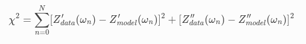

$\chi^2$ jest obliczane w ten sposób przez `scipy`, więc ja liczę w ten sam sposób.

Dodałem do `CircuitModel` funkcję:
- `show_parameters`, która printuje parametry w schludnej, małej tabelce
- `chi2`, która oblicza $\chi^2$